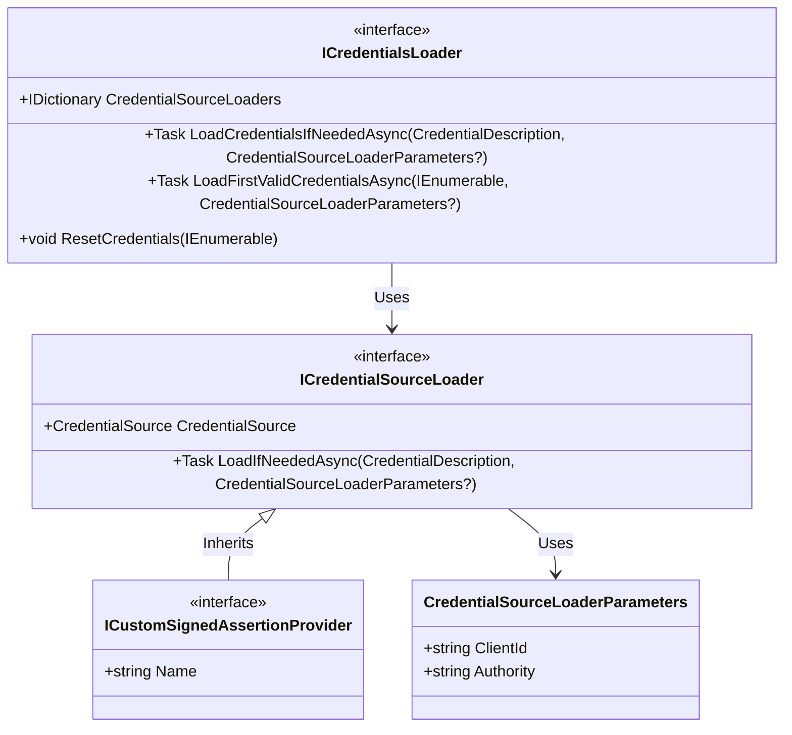

 

# Microsoft.Identity.Abstractions

Microsoft.Identity.Abstractions contain interfaces and POCO classes used in the Microsoft .NET authentication
libraries (Microsoft.IdentityModel, MSAL.NET and Microsoft.Identity.Web). It exposes concepts in three domains:

## NuGet Package

## Version Lifecycle and Support Matrix

See [Long Term Support policy](./supportPolicy.md) for details.

The following table lists Microsoft.Identity.Abstractions versions currently supported and receiving security fixes.

| Major Version | Last Release | Patch release date  | Support phase|End of support |
| --------------|--------------|--------|------------|--------|
| 9.x           |  |

## Concepts

### Overview (Condensed)
A condensed view of the main data classes, options, and relationships. Overloaded members for IDownstreamApi are truncated with ellipsis.

```mermaid
classDiagram
    namespace ApplicationOptions {
        class CredentialDescription {
            <<ro>> +string Id
            <<rw>> +CredentialSource SourceType
            <<rw>> +string KeyVaultUrl
            <<rw>> +string CertificateStorePath
            <<rw>> +string CertificateDistinguishedName
            <<rw>> +string KeyVaultCertificateName
            <<rw>> +string CertificateThumbprint
            <<rw>> +string CertificateDiskPath
            <<rw>> +string CertificatePassword
            <<rw>> +string Base64EncodedValue
            <<rw>> +string ClientSecret
            <<rw>> +string ManagedIdentityClientId
            <<rw>> +string SignedAssertionFileDiskPath
            <<rw>> +AuthorizationHeaderProviderOptions DecryptKeysAuthenticationOptions
            <<rw>> +string TokenExchangeAuthority
            <<rw>> +X509Certificate2 Certificate
            <<rw>> +object CachedValue
            <<rw>> +bool Skip
            <<ro>> +CredentialType CredentialType
            <<rw>> +string TokenExchangeUrl
            <<rw>> +string CustomSignedAssertionProviderName
            <<rw>> +Dictionary<string,object> CustomSignedAssertionProviderData
            <<rw>> +string Algorithm
        }
        class CredentialSource { <<enum>> }
        class CredentialType { <<enum>> }
        class IdentityApplicationOptions {
            <<rw>> +string Authority
            <<rw>> +string ClientId
            <<rw>> +bool EnablePiiLogging
            <<rw>> +IDictionary<string,string> ExtraQueryParameters
            <<rw>> +IEnumerable<CredentialDescription> ClientCredentials
            <<rw>> +string Audience
            <<rw>> +IEnumerable<string> Audiences
            <<rw>> +IEnumerable<CredentialDescription> TokenDecryptionCredentials
            <<rw>> +bool AllowWebApiToBeAuthorizedByACL
        }
        class MicrosoftEntraApplicationOptions {
            <<rw>> +string Name
            <<rw>> +string Instance
            <<rw>> +string TenantId
            <<rw>> +string Authority
            <<rw>> +string AppHomeTenantId
            <<rw>> +string AzureRegion
            <<rw>> +IEnumerable<string> ClientCapabilities
            <<rw>> +bool SendX5C
        }
        class MicrosoftIdentityApplicationOptions {
            <<rw>> +bool WithSpaAuthCode
            <<rw>> +string Domain
            <<rw>> +string EditProfilePolicyId
            <<rw>> +string SignUpSignInPolicyId
            <<rw>> +string ResetPasswordPolicyId
            <<ro>> +string DefaultUserFlow
            <<rw>> +string ResetPasswordPath
            <<rw>> +string ErrorPath
        }
    }
    namespace TokenAcquisition {
        class AcquireTokenOptions {
            +AcquireTokenOptions Clone()
            <<rw>> +string AuthenticationOptionsName
            <<rw>> +Nullable<Guid> CorrelationId
            <<rw>> +IDictionary<string,string> ExtraQueryParameters
            <<rw>> +IDictionary<string,object> ExtraParameters
            <<rw>> +IDictionary<string,string> ExtraHeaderParameters
            <<rw>> +string Claims
            <<rw>> +string FmiPath
            <<rw>> +bool ForceRefresh
            <<rw>> +string PopPublicKey
            <<rw>> +string PopClaim
            <<rw>> +ManagedIdentityOptions ManagedIdentity
            <<rw>> +string LongRunningWebApiSessionKey
            <<ro>> +string LongRunningWebApiSessionKeyAuto
            <<rw>> +string Tenant
            <<rw>> +string UserFlow
        }
        class AcquireTokenResult {
            <<rw>> +string AccessToken
            <<rw>> +DateTimeOffset ExpiresOn
            <<rw>> +string TenantId
            <<rw>> +string IdToken
            <<rw>> +IEnumerable<string> Scopes
            <<rw>> +Guid CorrelationId
            <<rw>> +string TokenType
            <<rw>> +IReadOnlyDictionary<string,string> AdditionalResponseParameters
            <<rw>> +X509Certificate2 BindingCertificate
        }
        class ITokenAcquirer { <<interface>> }
        class ITokenAcquirerFactory { <<interface>> }
        class ManagedIdentityOptions { <<rw>> +string UserAssignedClientId }
    }
    namespace DownstreamApis {
        class AuthorizationHeaderProviderOptions {
            +AuthorizationHeaderProviderOptions Clone()
            <<rw>> +string BaseUrl
            <<rw>> +string RelativePath
            <<rw>> +string HttpMethod
            <<rw>> +Action<HttpRequestMessage> CustomizeHttpRequestMessage
            <<rw>> +AcquireTokenOptions AcquireTokenOptions
            <<rw>> +string ProtocolScheme
            <<rw>> +bool RequestAppToken
        }
        class DownstreamApiOptions {
            +DownstreamApiOptions Clone()
            <<rw>> +IEnumerable<string> Scopes
            <<rw>> +Func<object?,HttpContent?> Serializer
            <<rw>> +Func<HttpContent?,object?> Deserializer
            <<rw>> +string AcceptHeader
            <<rw>> +string ContentType
            <<rw>> +IDictionary<string,string> ExtraQueryParameters
            <<rw>> +IDictionary<string,string> ExtraHeaderParameters
        }
        class DownstreamApiOptionsReadOnlyHttpMethod { <<ro>> +string HttpMethod }
        class IAuthorizationHeaderProvider { <<interface>> }
        class IAuthorizationHeaderProvider~TResult~ { <<interface>> }
        class IDownstreamApi { <<interface>> +CallApiAsync(...) +CallApiForUserAsync(...) +CallApiForAppAsync(...) +Generic & AOT overloads ... }
    }

    IdentityApplicationOptions <|-- MicrosoftEntraApplicationOptions : Inherits
    MicrosoftEntraApplicationOptions <|-- MicrosoftIdentityApplicationOptions : Inherits
    AuthorizationHeaderProviderOptions <|-- DownstreamApiOptions : Inherits
    DownstreamApiOptions <|-- DownstreamApiOptionsReadOnlyHttpMethod : Inherits
    CredentialDescription *-- CredentialSource : Has
    CredentialDescription *-- CredentialType : Has
    IdentityApplicationOptions --> CredentialDescription : "ClientCredentials" Has many
    IdentityApplicationOptions --> CredentialDescription : "TokenDecryptionCredentials" Has many
    AuthorizationHeaderProviderOptions --> AcquireTokenOptions : Has
    AcquireTokenOptions --> ManagedIdentityOptions : Has
    ITokenAcquirerFactory --> ITokenAcquirer : produces
    ITokenAcquirer --> AcquireTokenOptions : parametrized by
    ITokenAcquirer --> AcquireTokenResult : returns

    note for AuthorizationHeaderProviderOptions "Defaults: ProtocolScheme=Bearer, HttpMethod=Get"
    note for DownstreamApiOptions "Defaults: AcceptHeader=application/json, ContentType=application/json"
    note for IdentityApplicationOptions "Effective audiences = Audience ∪ Audiences"
```

### Full API Surface (Expanded)
The expanded diagram lists all overloads of IDownstreamApi and highlights extensibility points.

```mermaid
classDiagram
    class IDownstreamApi {
        +Task<HttpResponseMessage> CallApiAsync(DownstreamApiOptions, ClaimsPrincipal?, HttpContent?, CancellationToken)
        +Task<HttpResponseMessage> CallApiAsync(string?, Action<DownstreamApiOptions>?, ClaimsPrincipal?, HttpContent?, CancellationToken)
        +Task<HttpResponseMessage> CallApiForUserAsync(string?, Action<DownstreamApiOptions>?, ClaimsPrincipal?, HttpContent?, CancellationToken)
        +Task<HttpResponseMessage> CallApiForAppAsync(string?, Action<DownstreamApiOptions>?, HttpContent?, CancellationToken)
        +Task<TOutput?> CallApiForUserAsync<TInput,TOutput>(string?, TInput, Action<DownstreamApiOptions>?, ClaimsPrincipal?, CancellationToken) where TOutput:class
        +Task<TOutput?> CallApiForUserAsync<TOutput>(string, Action<DownstreamApiOptions>?, ClaimsPrincipal?, CancellationToken) where TOutput:class
        +Task<TOutput?> CallApiForAppAsync<TInput,TOutput>(string?, TInput, Action<DownstreamApiOptions>?, CancellationToken) where TOutput:class
        +Task<TOutput?> CallApiForAppAsync<TOutput>(string, Action<DownstreamApiOptions>?, CancellationToken) where TOutput:class
        +Task<TOutput?> CallApiForUserAsync<TInput,TOutput>(string?, TInput, JsonTypeInfo<TInput>, JsonTypeInfo<TOutput>, Action<DownstreamApiOptions>?, ClaimsPrincipal?, CancellationToken) where TOutput:class
        +Task<TOutput?> CallApiForUserAsync<TOutput>(string, JsonTypeInfo<TOutput>, Action<DownstreamApiOptions>?, ClaimsPrincipal?, CancellationToken) where TOutput:class
        +Task<TOutput?> CallApiForAppAsync<TInput,TOutput>(string?, TInput, JsonTypeInfo<TInput>, JsonTypeInfo<TOutput>, Action<DownstreamApiOptions>?, CancellationToken) where TOutput:class
        +Task<TOutput?> CallApiForAppAsync<TOutput>(string, JsonTypeInfo<TOutput>, Action<DownstreamApiOptions>?, CancellationToken) where TOutput:class
    }
    class IAuthorizationHeaderProvider {
        +Task<string> CreateAuthorizationHeaderForUserAsync(IEnumerable<string>, AuthorizationHeaderProviderOptions, ClaimsPrincipal?, CancellationToken)
        +Task<string> CreateAuthorizationHeaderForAppAsync(string, AuthorizationHeaderProviderOptions?, CancellationToken)
        +Task<string> CreateAuthorizationHeaderAsync(IEnumerable<string>, AuthorizationHeaderProviderOptions?, ClaimsPrincipal?, CancellationToken)
    }
    class IAuthorizationHeaderProvider~TResult~ {
        +Task<TResult> CreateAuthorizationHeaderAsync(DownstreamApiOptions, ClaimsPrincipal?, CancellationToken)
    }
```

### Extensibility Diagram
Credential loading extensibility points.

### Token acquisition
(Section retained; see diagrams above.)

### Call downstream APIs
(See condensed and expanded diagrams.)

## Contributing

This project welcomes contributions and suggestions.  Most contributions require you to agree to a
Contributor License Agreement (CLA) declaring that you have the right to, and actually do, grant us
The rights to use your contribution. For details, visit https://cla.opensource.microsoft.com.

When you submit a pull request, a CLA bot will automatically determine whether you need to provide
a CLA and decorate the PR appropriately (e.g., status check, comment). Simply follow the instructions
provided by the bot. You will only need to do this once across all repos using our CLA.

This project has adopted the [Microsoft Open Source Code of Conduct](https://opensource.microsoft.com/codeofconduct/).
For more information see the [Code of Conduct FAQ](https://opensource.microsoft.com/codeofconduct/faq/) or
contact [opencode@microsoft.com](mailto:opencode@microsoft.com) with any additional questions or comments.

## Trademarks

This project may contain trademarks or logos for projects, products, or services. Authorized use of Microsoft
trademarks or logos is subject to and must follow
[Microsoft's Trademark & Brand Guidelines](https://www.microsoft.com/en-us/legal/intellectualproperty/trademarks/usage/general).
Use of Microsoft trademarks or logos in modified versions of this project must not cause confusion or imply Microsoft sponsorship.
Any use of third-party trademarks or logos are subject to those third-party's policies.
