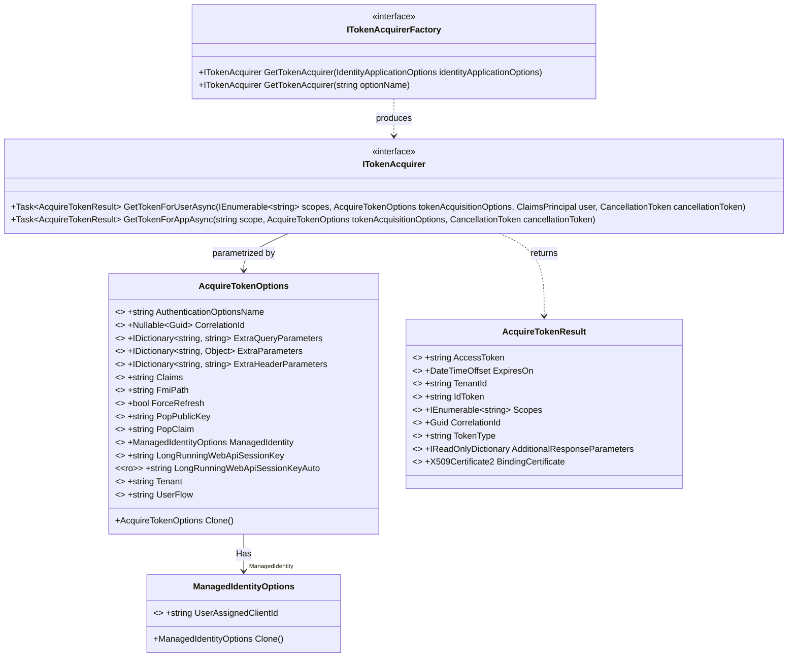

[](https://github.com/AzureAD/microsoft-identity-abstractions-for-dotnet/actions/workflows/dotnetcore.yml) 

# Microsoft.Identity.Abstractions

Microsoft.Identity.Abstractions contain interfaces and POCO classes used in the Microsoft .NET authentication
libraries (Microsoft.IdentityModel, MSAL.NET and Microsoft.Identity.Web). It exposes concepts in three domains:
- Application and credentials
- Acquire tokens, get authorization headers and call downstream APIs
- Extensibility to bring your own credential providers

## NuGet Package

[](https://www.nuget.org/packages/Microsoft.Identity.Abstractions/)

## Version Lifecycle and Support Matrix

See [Long Term Support policy](./supportPolicy.md) for details.

The following table lists Microsoft.Identity.Abstractions versions currently supported and receiving security fixes.

| Major Version | Last Release | Patch release date  | Support phase|End of support |
| --------------|--------------|--------|------------|--------|
| 9.x           | [](https://www.nuget.org/packages/Microsoft.Identity.Abstractions/)    |Monthly| Active | Not planned.<br/>✅Supported versions: from 9.0.0 to [](https://www.nuget.org/packages/Microsoft.Identity.Abstractions/) <br/>⚠️Unsupported versions `< 9.0.0`.|


## Concepts

### Overview of the data classes
the following diagram provides an overview of the data classes exposed by Microsoft.Identity.Abstractions

```mermaid
classDiagram
   namespace ApplicationOptions {
      class CredentialDescription {
            <<ro>> +string Id
            <<rw>> +CredentialSource SourceType
            <<rw>> +string KeyVaultUrl
            <<rw>> +string CertificateStorePath
            <<rw>> +string CertificateDistinguishedName
            <<rw>> +string KeyVaultCertificateName
            <<rw>> +string CertificateThumbprint
            <<rw>> +string CertificateDiskPath
            <<rw>> +string CertificatePassword
            <<rw>> +string Base64EncodedValue
            <<rw>> +string ClientSecret
            <<rw>> +string ManagedIdentityClientId
            <<rw>> +string SignedAssertionFileDiskPath
            <<rw>> +AuthorizationHeaderProviderOptions DecryptKeysAuthenticationOptions
            <<rw>> +string TokenExchangeAuthority
            <<rw>> +X509Certificate2 Certificate
            <<rw>> +object CachedValue
            <<rw>> +bool Skip
            <<ro>> +CredentialType CredentialType
            <<rw>> +string TokenExchangeUrl
            <<rw>> +string CustomSignedAssertionProviderName
            <<rw>> +Dictionary<string,object> CustomSignedAssertionProviderData
            <<rw>> +string Algorithm
        }
    class CredentialSource { <<enum>>
    Certificate = 0
    KeyVault = 1
    Base64Encoded = 2
    Path = 3
    StoreWithThumbprint = 4
    StoreWithDistinguishedName = 5
    ClientSecret = 6
    SignedAssertionFromManagedIdentity = 7
    SignedAssertionFilePath = 8
    SignedAssertionFromVault = 9
    AutoDecryptKeys = 10
    CustomSignedAssertion = 11
    }
    class CredentialType { <<enum>>
    Certificate = 0
    Secret = 1
    SignedAssertion = 2
    DecryptKeys = 3
    }
    class IdentityApplicationOptions {
            <<rw>> +string Authority
            <<rw>> +string ClientId
            <<rw>> +bool EnablePiiLogging
            <<rw>> +IDictionary<string,string> ExtraQueryParameters
            <<rw>> +IEnumerable<CredentialDescription> ClientCredentials
            <<rw>> +string Audience
            <<rw>> +IEnumerable<string> Audiences
            <<rw>> +IEnumerable<CredentialDescription> TokenDecryptionCredentials
            <<rw>> +bool AllowWebApiToBeAuthorizedByACL
    }
    class MicrosoftEntraApplicationOptions {
            <<rw>> +string Name
            <<rw>> +string Instance
            <<rw>> +string TenantId
            <<rw>> +string Authority
            <<rw>> +string AppHomeTenantId
            <<rw>> +string AzureRegion
            <<rw>> +IEnumerable<string> ClientCapabilities
            <<rw>> +bool SendX5C
    }
    class MicrosoftIdentityApplicationOptions {
            <<rw>> +bool WithSpaAuthCode
            <<rw>> +string Domain
            <<rw>> +string EditProfilePolicyId
            <<rw>> +string SignUpSignInPolicyId
            <<rw>> +string ResetPasswordPolicyId
            <<ro>> +string DefaultUserFlow
            <<rw>> +string ResetPasswordPath
            <<rw>> +string ErrorPath
    }
 }

namespace TokenAcquisition {
    class AcquireTokenOptions {
           +AcquireTokenOptions Clone()
            <<rw>> +string AuthenticationOptionsName
            <<rw>> +Nullable<Guid> CorrelationId
            <<rw>> +IDictionary<string,string> ExtraQueryParameters
            <<rw>> +IDictionary<string,object> ExtraParameters
            <<rw>> +IDictionary<string,string> ExtraHeaderParameters
            <<rw>> +string Claims
            <<rw>> +string FmiPath
            <<rw>> +bool ForceRefresh
            <<rw>> +string PopPublicKey
            <<rw>> +string PopClaim
            <<rw>> +ManagedIdentityOptions ManagedIdentity
            <<rw>> +string LongRunningWebApiSessionKey
            <<ro>> +string LongRunningWebApiSessionKeyAuto
            <<rw>> +string Tenant
            <<rw>> +string UserFlow
    }
    class AcquireTokenResult {
            <<rw>> +string AccessToken
            <<rw>> +DateTimeOffset ExpiresOn
            <<rw>> +string TenantId
            <<rw>> +string IdToken
            <<rw>> +IEnumerable<string> Scopes
            <<rw>> +Guid CorrelationId
            <<rw>> +string TokenType
            <<rw>> +IReadOnlyDictionary<string,string> AdditionalResponseParameters
            <<rw>> +X509Certificate2 BindingCertificate
    }
    class ITokenAcquirer { <<interface>>
    +Task&lt;AcquireTokenResult&gt; GetTokenForUserAsync(IEnumerable&lt;string&gt; scopes, AcquireTokenOptions tokenAcquisitionOptions, ClaimsPrincipal user, CancellationToken cancellationToken)
    +Task&lt;AcquireTokenResult&gt; GetTokenForAppAsync(string scope, AcquireTokenOptions tokenAcquisitionOptions, CancellationToken cancellationToken)
    }
    class ITokenAcquirerFactory { <<interface>>
    +ITokenAcquirer GetTokenAcquirer(IdentityApplicationOptions identityApplicationOptions)
    +ITokenAcquirer GetTokenAcquirer(string optionName)
    }
    class ManagedIdentityOptions {
    +ManagedIdentityOptions Clone()
    <<rw>> +string UserAssignedClientId
    }
 }

        namespace DownstreamApis {
    class AuthorizationHeaderProviderOptions {
    +AuthorizationHeaderProviderOptions Clone()
    #AuthorizationHeaderProviderOptions CloneInternal()
    +string GetApiUrl()
            <<rw>> +string BaseUrl
            <<rw>> +string RelativePath
            <<rw>> +string HttpMethod
            <<rw>> +Action<HttpRequestMessage> CustomizeHttpRequestMessage
            <<rw>> +AcquireTokenOptions AcquireTokenOptions
            <<rw>> +string ProtocolScheme
            <<rw>> +bool RequestAppToken
    }
    class DownstreamApiOptions {
    +DownstreamApiOptions Clone()
    #AuthorizationHeaderProviderOptions CloneInternal()
         <<rw>> +IEnumerable<string> Scopes
            <<rw>> +Func<object?,HttpContent?> Serializer
            <<rw>> +Func<HttpContent?,object?> Deserializer
            <<rw>> +string AcceptHeader
            <<rw>> +string ContentType
            <<rw>> +IDictionary<string,string> ExtraQueryParameters
            <<rw>> +IDictionary<string,string> ExtraHeaderParameters
    }
    class DownstreamApiOptionsReadOnlyHttpMethod {
    +DownstreamApiOptionsReadOnlyHttpMethod Clone()
    #AuthorizationHeaderProviderOptions CloneInternal()
    <<ro>> +string HttpMethod
    }

        class IAuthorizationHeaderProvider { <<interface>> }
        class IAuthorizationHeaderProvider~TResult~ { <<interface>> }
        class IDownstreamApi { <<interface>>
               +CallApiAsync(...)
               +CallApiForUserAsync(...)
               +CallApiForAppAsync(...)
                +Generic & AOT overloads ... }
 }


    IdentityApplicationOptions <|-- MicrosoftEntraApplicationOptions : Inherits
    MicrosoftEntraApplicationOptions <|-- MicrosoftIdentityApplicationOptions : Inherits
    AuthorizationHeaderProviderOptions <|-- DownstreamApiOptions : Inherits
    DownstreamApiOptions <|-- DownstreamApiOptionsReadOnlyHttpMethod : Inherits

    CredentialDescription *-- "SourceType" CredentialSource : Has
    CredentialDescription --> "DecryptKeysAuthenticationOptions" AuthorizationHeaderProviderOptions : Has
    CredentialDescription *-- "CredentialType" CredentialType : Has

    IdentityApplicationOptions --> "ClientCredentials" CredentialDescription : Has many
    IdentityApplicationOptions --> "TokenDecryptionCredentials" CredentialDescription : Has many
    AuthorizationHeaderProviderOptions --> "AcquireTokenOptions" AcquireTokenOptions : Has
    AcquireTokenOptions --> "ManagedIdentity" ManagedIdentityOptions : Has

   ITokenAcquirerFactory --> ITokenAcquirer : produces
   ITokenAcquirer -->  AcquireTokenOptions : parametrized by
   AcquireTokenOptions --> "ManagedIdentity" ManagedIdentityOptions : Has
   ITokenAcquirer -->  AcquireTokenResult : returns
```



Note:
- for `AuthorizationHeaderProviderOptions` "Defaults: ProtocolScheme=Bearer, HttpMethod=Get"
-  for `DownstreamApiOptions` "Defaults: AcceptHeader=application/json, ContentType=application/json
-  for `IdentityApplicationOptions` "Effective audiences = Audience ∪ Audiences"

### Application options and credentials

   The application options are typically the options that you find in configuration files like the appsettings.json
   file. They describe the authentication aspects of your application. The library offers two layer. A standard
   layer, and a Microsoft Identity platform specialization.

  ```mermaid
  classDiagram
   class CredentialDescription {
    &lt;&lt;ro&gt;&gt; +string Id
    <<rw>> +CredentialSource SourceType
    <<rw>> +string KeyVaultUrl
    <<rw>> +string CertificateStorePath
    <<rw>> +string CertificateDistinguishedName
    <<rw>> +string KeyVaultCertificateName
    <<rw>> +string CertificateThumbprint
    <<rw>> +string CertificateDiskPath
    <<rw>> +string CertificatePassword
    <<rw>> +string Base64EncodedValue
    <<rw>> +string ClientSecret
    <<rw>> +string ManagedIdentityClientId
    <<rw>> +string SignedAssertionFileDiskPath
    <<rw>> +AuthorizationHeaderProviderOptions DecryptKeysAuthenticationOptions
    <<rw>> +string TokenExchangeAuthority
    <<rw>> +X509Certificate2 Certificate
    <<rw>> +Object CachedValue
    <<rw>> +bool Skip
    &lt;&lt;ro&gt;&gt; +CredentialType CredentialType
    <<rw>> +string TokenExchangeUrl
    <<rw>> +string CustomSignedAssertionProviderName
    <<rw>> +Dictionary&lt;string, Object&gt; CustomSignedAssertionProviderData
    <<rw>> +string Algorithm
    }
    class CredentialSource { <<enum>>
    Certificate = 0
    KeyVault = 1
    Base64Encoded = 2
    Path = 3
    StoreWithThumbprint = 4
    StoreWithDistinguishedName = 5
    ClientSecret = 6
    SignedAssertionFromManagedIdentity = 7
    SignedAssertionFilePath = 8
    SignedAssertionFromVault = 9
    AutoDecryptKeys = 10
    CustomSignedAssertion = 11
    }
    class CredentialType { <<enum>>
    Certificate = 0
    Secret = 1
    SignedAssertion = 2
    DecryptKeys = 3
    }
    class IdentityApplicationOptions {
    <<rw>> +string Authority
    <<rw>> +string ClientId
    <<rw>> +bool EnablePiiLogging
    <<rw>> +IDictionary&lt;string, string&gt; ExtraQueryParameters
    <<rw>> +IEnumerable&lt;CredentialDescription&gt; ClientCredentials
    <<rw>> +string Audience
    <<rw>> +IEnumerable&lt;string&gt; Audiences
    <<rw>> +IEnumerable&lt;CredentialDescription&gt; TokenDecryptionCredentials
    <<rw>> +bool AllowWebApiToBeAuthorizedByACL
    }
    class MicrosoftEntraApplicationOptions {
    <<rw>> +string Name
    <<rw>> +string Instance
    <<rw>> +string TenantId
    <<rw>> +string Authority
    <<rw>> +string AppHomeTenantId
    <<rw>> +string AzureRegion
    <<rw>> +IEnumerable&lt;string&gt; ClientCapabilities
    <<rw>> +bool SendX5C
    }
    class MicrosoftIdentityApplicationOptions {
    <<rw>> +bool WithSpaAuthCode
    <<rw>> +string Domain
    <<rw>> +string EditProfilePolicyId
    <<rw>> +string SignUpSignInPolicyId
    <<rw>> +string ResetPasswordPolicyId
    &lt;&lt;ro&gt;&gt; +string DefaultUserFlow
    <<rw>> +string ResetPasswordPath
    <<rw>> +string ErrorPath
    }

    IdentityApplicationOptions <|-- MicrosoftEntraApplicationOptions : Inherits
    MicrosoftEntraApplicationOptions <|-- MicrosoftIdentityApplicationOptions : Inherits

    CredentialDescription *-- "SourceType" CredentialSource : Has
    CredentialDescription --> "DecryptKeysAuthenticationOptions" AuthorizationHeaderProviderOptions : Has
    note for AuthorizationHeaderProviderOptions "see below"
    CredentialDescription *-- "CredentialType" CredentialType : Has
    IdentityApplicationOptions --> "ClientCredentials" CredentialDescription : Has many
    IdentityApplicationOptions --> "TokenDecryptionCredentials" CredentialDescription : Has many

   ```

For details about Credentials, see [CredentialDecription](./docs/credentialdescription.md)

### Credential loaders
   An important part of the application options are the credentials. In addition to the credential descriptions, the
   library offers extensibility mechanisms so that implementers can add their own credential source loaders.

   ```mermaid
   classDiagram
   class CredentialSourceLoaderParameters {
    <<rw>> +string ClientId
    <<rw>> +string Authority
    }
    class ICredentialsLoader { <<interface>>
    +Task LoadCredentialsIfNeededAsync(CredentialDescription credentialDescription, CredentialSourceLoaderParameters parameters)
    +Task&lt;CredentialDescription&gt; LoadFirstValidCredentialsAsync(IEnumerable&lt;CredentialDescription&gt; credentialDescriptions, CredentialSourceLoaderParameters parameters)
    +Void ResetCredentials(IEnumerable&lt;CredentialDescription&gt; credentialDescriptions)
    &lt;&lt;ro&gt;&gt; +IDictionary&lt;CredentialSource, ICredentialSourceLoader&gt; CredentialSourceLoaders
    }
    class ICredentialSourceLoader { <<interface>>
    +Task LoadIfNeededAsync(CredentialDescription credentialDescription, CredentialSourceLoaderParameters parameters)
    &lt;&lt;ro&gt;&gt; +CredentialSource CredentialSource
    }
    class ICustomSignedAssertionProvider { <<interface>>
    &lt;&lt;ro&gt;&gt; +string Name
    }

    ICredentialSourceLoader <|-- ICustomSignedAssertionProvider : Inherits
    ICredentialSourceLoader *-- "CredentialSource" CredentialSource : Has
    ICredentialsLoader --> ICredentialSourceLoader : Loads
    ICredentialSourceLoader --> CredentialSourceLoaderParameters : Uses
    note for CredentialSource "see above"
   ```

   There can be several application options with different names (for instance in ASP.NET Core these would be different
   authentication schemes)

### Token acquisition

Once configured, an application can acquire tokens from the Identity provider. This is a low level API, in the sense that
you would probably prefer to call downstream web APIs without having to be preoccupied about the authentication aspects. If you
really want to use the lower level API, you should:
- get hold of a ITokenAcquirerFactory. Implementations can provide a TokenAcquirerFactory for instance, with a singleton.
- get a ITokenAcquirer (by its name, for instance). This corresponds to the application options
- From the token acquirer get a token for on behalf of the user, or the app. If you don't specify any AcquireTokenOptions,
  the implementation should do its best effort. The AcquireTokenOptions enable you to override the defaults.



## Call downstream APIs

It's also possible (and recommended) to use higher level APIs:
- IDownstreamApi enables you to call a downstream web API and let the implementation handle the serialization of the
  input parameter (if any), handling the getting the authorization header and attaching it to the HttpClient, call
  the downstream web API, handle errors, deserialize the answer and return it as a strongly typed object. You can
  use customize all these steps, for instance by providing your own serializer / deserializer.
- IAuthorizationHeaderProvider is the component that provides the authorization header, delegating to the ITokenAcquirer.
  Whereas ITokenAcquirer only knows about tokens, IAuthorizationHeaderProvider knows about protocols (for instance bearer,
  Pop, etc ...)

 ```mermaid
 classDiagram
    class AuthorizationHeaderProviderOptions {
    +AuthorizationHeaderProviderOptions Clone()
    #AuthorizationHeaderProviderOptions CloneInternal()
    +string GetApiUrl()
    <<rw>> +string BaseUrl
    <<rw>> +string RelativePath
    <<rw>> +string HttpMethod
    <<rw>> +Action&lt;HttpRequestMessage&gt; CustomizeHttpRequestMessage
    <<rw>> +AcquireTokenOptions AcquireTokenOptions
    <<rw>> +string ProtocolScheme
    <<rw>> +bool RequestAppToken
    }
    class DownstreamApiOptions {
    +DownstreamApiOptions Clone()
    #AuthorizationHeaderProviderOptions CloneInternal()
    <<rw>> +IEnumerable&lt;string&gt; Scopes
    <<rw>> +Func&lt;Object, HttpContent&gt; Serializer
    <<rw>> +Func&lt;HttpContent, Object&gt; Deserializer
    <<rw>> +string AcceptHeader
    <<rw>> +string ContentType
    <<rw>> +IDictionary&lt;string, string&gt; ExtraQueryParameters
    <<rw>> +IDictionary&lt;string, string&gt; ExtraHeaderParameters
    }
    class DownstreamApiOptionsReadOnlyHttpMethod {
    +DownstreamApiOptionsReadOnlyHttpMethod Clone()
    #AuthorizationHeaderProviderOptions CloneInternal()
    <<ro>> +string HttpMethod
    }
    class IAuthorizationHeaderProvider { <<interface>>
    +Task&lt;string&gt; CreateAuthorizationHeaderForUserAsync(IEnumerable&lt;string&gt; scopes, AuthorizationHeaderProviderOptions authorizationHeaderProviderOptions, ClaimsPrincipal claimsPrincipal, CancellationToken cancellationToken)
    +Task&lt;string&gt; CreateAuthorizationHeaderForAppAsync(string scopes, AuthorizationHeaderProviderOptions downstreamApiOptions, CancellationToken cancellationToken)
    +Task&lt;string&gt; CreateAuthorizationHeaderAsync(IEnumerable&lt;string&gt; scopes, AuthorizationHeaderProviderOptions options, ClaimsPrincipal claimsPrincipal, CancellationToken cancellationToken)
    }
    class IDownstreamApi { <<interface>>
    +Task&lt;HttpResponseMessage&gt; CallApiAsync(DownstreamApiOptions downstreamApiOptions, ClaimsPrincipal user, HttpContent content, CancellationToken cancellationToken)
    +Task&lt;HttpResponseMessage&gt; CallApiAsync(string serviceName, Action&lt;DownstreamApiOptions&gt; downstreamApiOptionsOverride, ClaimsPrincipal user, HttpContent content, CancellationToken cancellationToken)
    +Task&lt;HttpResponseMessage&gt; CallApiForUserAsync(string serviceName, Action&lt;DownstreamApiOptions&gt; downstreamApiOptionsOverride, ClaimsPrincipal user, HttpContent content, CancellationToken cancellationToken)
    +Task&lt;HttpResponseMessage&gt; CallApiForAppAsync(string serviceName, Action&lt;DownstreamApiOptions&gt; downstreamApiOptionsOverride, HttpContent content, CancellationToken cancellationToken)
    +Task&lt;IDownstreamApi.TOutput&gt; CallApiForUserAsync(string serviceName, IDownstreamApi.TInput input, Action&lt;DownstreamApiOptions&gt; downstreamApiOptionsOverride, ClaimsPrincipal user, CancellationToken cancellationToken)
    +Task&lt;IDownstreamApi.TOutput&gt; CallApiForUserAsync(string serviceName, Action&lt;DownstreamApiOptions&gt; downstreamApiOptionsOverride, ClaimsPrincipal user, CancellationToken cancellationToken)
    +Task&lt;IDownstreamApi.TOutput&gt; CallApiForAppAsync(string serviceName, IDownstreamApi.TInput input, Action&lt;DownstreamApiOptions&gt; downstreamApiOptionsOverride, CancellationToken cancellationToken)
    +Task&lt;IDownstreamApi.TOutput&gt; CallApiForAppAsync(string serviceName, Action&lt;DownstreamApiOptions&gt; downstreamApiOptionsOverride, CancellationToken cancellationToken)
    +Task&lt;IDownstreamApi.TOutput&gt; CallApiForUserAsync(string serviceName, IDownstreamApi.TInput input, JsonTypeInfo&lt;IDownstreamApi.TInput&gt; inputJsonTypeInfo, JsonTypeInfo&lt;IDownstreamApi.TOutput&gt; outputJsonTypeInfo, Action&lt;DownstreamApiOptions&gt; downstreamApiOptionsOverride, ClaimsPrincipal user, CancellationToken cancellationToken)
    +Task&lt;IDownstreamApi.TOutput&gt; CallApiForUserAsync(string serviceName, JsonTypeInfo&lt;IDownstreamApi.TOutput&gt; outputJsonTypeInfo, Action&lt;DownstreamApiOptions&gt; downstreamApiOptionsOverride, ClaimsPrincipal user, CancellationToken cancellationToken)
    +Task&lt;IDownstreamApi.TOutput&gt; CallApiForAppAsync(string serviceName, IDownstreamApi.TInput input, JsonTypeInfo&lt;IDownstreamApi.TInput&gt; inputJsonTypeInfo, JsonTypeInfo&lt;IDownstreamApi.TOutput&gt; outputJsonTypeInfo, Action&lt;DownstreamApiOptions&gt; downstreamApiOptionsOverride, CancellationToken cancellationToken)
    +Task&lt;IDownstreamApi.TOutput&gt; CallApiForAppAsync(string serviceName, JsonTypeInfo&lt;IDownstreamApi.TOutput&gt; outputJsonTypeInfo, Action&lt;DownstreamApiOptions&gt; downstreamApiOptionsOverride, CancellationToken cancellationToken)
    +Task&lt;IDownstreamApi.TOutput&gt; GetForUserAsync(string serviceName, Action&lt;DownstreamApiOptionsReadOnlyHttpMethod&gt; downstreamApiOptionsOverride, ClaimsPrincipal user, CancellationToken cancellationToken)
    +Task&lt;IDownstreamApi.TOutput&gt; GetForUserAsync(string serviceName, IDownstreamApi.TInput input, Action&lt;DownstreamApiOptionsReadOnlyHttpMethod&gt; downstreamApiOptionsOverride, ClaimsPrincipal user, CancellationToken cancellationToken)
    +Task&lt;IDownstreamApi.TOutput&gt; GetForAppAsync(string serviceName, Action&lt;DownstreamApiOptionsReadOnlyHttpMethod&gt; downstreamApiOptionsOverride, CancellationToken cancellationToken)
    +Task&lt;IDownstreamApi.TOutput&gt; GetForAppAsync(string serviceName, IDownstreamApi.TInput input, Action&lt;DownstreamApiOptionsReadOnlyHttpMethod&gt; downstreamApiOptionsOverride, CancellationToken cancellationToken)
    +Task PostForUserAsync(string serviceName, IDownstreamApi.TInput input, Action&lt;DownstreamApiOptionsReadOnlyHttpMethod&gt; downstreamApiOptionsOverride, ClaimsPrincipal user, CancellationToken cancellationToken)
    +Task&lt;IDownstreamApi.TOutput&gt; PostForUserAsync(string serviceName, IDownstreamApi.TInput input, Action&lt;DownstreamApiOptionsReadOnlyHttpMethod&gt; downstreamApiOptionsOverride, ClaimsPrincipal user, CancellationToken cancellationToken)
    +Task PostForAppAsync(string serviceName, IDownstreamApi.TInput input, Action&lt;DownstreamApiOptionsReadOnlyHttpMethod&gt; downstreamApiOptionsOverride, CancellationToken cancellationToken)
    +Task&lt;IDownstreamApi.TOutput&gt; PostForAppAsync(string serviceName, IDownstreamApi.TInput input, Action&lt;DownstreamApiOptionsReadOnlyHttpMethod&gt; downstreamApiOptionsOverride, CancellationToken cancellationToken)
    +Task PutForUserAsync(string serviceName, IDownstreamApi.TInput input, Action&lt;DownstreamApiOptionsReadOnlyHttpMethod&gt; downstreamApiOptionsOverride, ClaimsPrincipal user, CancellationToken cancellationToken)
    +Task&lt;IDownstreamApi.TOutput&gt; PutForUserAsync(string serviceName, IDownstreamApi.TInput input, Action&lt;DownstreamApiOptionsReadOnlyHttpMethod&gt; downstreamApiOptionsOverride, ClaimsPrincipal user, CancellationToken cancellationToken)
    +Task PutForAppAsync(string serviceName, IDownstreamApi.TInput input, Action&lt;DownstreamApiOptionsReadOnlyHttpMethod&gt; downstreamApiOptionsOverride, CancellationToken cancellationToken)
    +Task&lt;IDownstreamApi.TOutput&gt; PutForAppAsync(string serviceName, IDownstreamApi.TInput input, Action&lt;DownstreamApiOptionsReadOnlyHttpMethod&gt; downstreamApiOptionsOverride, CancellationToken cancellationToken)
    +Task PatchForUserAsync(string serviceName, IDownstreamApi.TInput input, Action&lt;DownstreamApiOptionsReadOnlyHttpMethod&gt; downstreamApiOptionsOverride, ClaimsPrincipal user, CancellationToken cancellationToken)
    +Task&lt;IDownstreamApi.TOutput&gt; PatchForUserAsync(string serviceName, IDownstreamApi.TInput input, Action&lt;DownstreamApiOptionsReadOnlyHttpMethod&gt; downstreamApiOptionsOverride, ClaimsPrincipal user, CancellationToken cancellationToken)
    +Task PatchForAppAsync(string serviceName, IDownstreamApi.TInput input, Action&lt;DownstreamApiOptionsReadOnlyHttpMethod&gt; downstreamApiOptionsOverride, CancellationToken cancellationToken)
    +Task&lt;IDownstreamApi.TOutput&gt; PatchForAppAsync(string serviceName, IDownstreamApi.TInput input, Action&lt;DownstreamApiOptionsReadOnlyHttpMethod&gt; downstreamApiOptionsOverride, CancellationToken cancellationToken)
    +Task DeleteForUserAsync(string serviceName, IDownstreamApi.TInput input, Action&lt;DownstreamApiOptionsReadOnlyHttpMethod&gt; downstreamApiOptionsOverride, ClaimsPrincipal user, CancellationToken cancellationToken)
    +Task&lt;IDownstreamApi.TOutput&gt; DeleteForUserAsync(string serviceName, IDownstreamApi.TInput input, Action&lt;DownstreamApiOptionsReadOnlyHttpMethod&gt; downstreamApiOptionsOverride, ClaimsPrincipal user, CancellationToken cancellationToken)
    +Task DeleteForAppAsync(string serviceName, IDownstreamApi.TInput input, Action&lt;DownstreamApiOptionsReadOnlyHttpMethod&gt; downstreamApiOptionsOverride, CancellationToken cancellationToken)
    +Task&lt;IDownstreamApi.TOutput&gt; DeleteForAppAsync(string serviceName, IDownstreamApi.TInput input, Action&lt;DownstreamApiOptionsReadOnlyHttpMethod&gt; downstreamApiOptionsOverride, CancellationToken cancellationToken)
    +Task&lt;IDownstreamApi.TOutput&gt; GetForUserAsync(string serviceName, JsonTypeInfo&lt;IDownstreamApi.TOutput&gt; outputJsonTypeInfo, Action&lt;DownstreamApiOptionsReadOnlyHttpMethod&gt; downstreamApiOptionsOverride, ClaimsPrincipal user, CancellationToken cancellationToken)
    +Task&lt;IDownstreamApi.TOutput&gt; GetForUserAsync(string serviceName, IDownstreamApi.TInput input, JsonTypeInfo&lt;IDownstreamApi.TInput&gt; inputJsonTypeInfo, JsonTypeInfo&lt;IDownstreamApi.TOutput&gt; outputJsonTypeInfo, Action&lt;DownstreamApiOptionsReadOnlyHttpMethod&gt; downstreamApiOptionsOverride, ClaimsPrincipal user, CancellationToken cancellationToken)
    +Task&lt;IDownstreamApi.TOutput&gt; GetForAppAsync(string serviceName, JsonTypeInfo&lt;IDownstreamApi.TOutput&gt; outputJsonTypeInfo, Action&lt;DownstreamApiOptionsReadOnlyHttpMethod&gt; downstreamApiOptionsOverride, CancellationToken cancellationToken)
    +Task&lt;IDownstreamApi.TOutput&gt; GetForAppAsync(string serviceName, IDownstreamApi.TInput input, JsonTypeInfo&lt;IDownstreamApi.TInput&gt; inputJsonTypeInfo, JsonTypeInfo&lt;IDownstreamApi.TOutput&gt; outputJsonTypeInfo, Action&lt;DownstreamApiOptionsReadOnlyHttpMethod&gt; downstreamApiOptionsOverride, CancellationToken cancellationToken)
    +Task PostForUserAsync(string serviceName, IDownstreamApi.TInput input, JsonTypeInfo&lt;IDownstreamApi.TInput&gt; inputJsonTypeInfo, Action&lt;DownstreamApiOptionsReadOnlyHttpMethod&gt; downstreamApiOptionsOverride, ClaimsPrincipal user, CancellationToken cancellationToken)
    +Task&lt;IDownstreamApi.TOutput&gt; PostForUserAsync(string serviceName, IDownstreamApi.TInput input, JsonTypeInfo&lt;IDownstreamApi.TInput&gt; inputJsonTypeInfo, JsonTypeInfo&lt;IDownstreamApi.TOutput&gt; outputJsonTypeInfo, Action&lt;DownstreamApiOptionsReadOnlyHttpMethod&gt; downstreamApiOptionsOverride, ClaimsPrincipal user, CancellationToken cancellationToken)
    +Task PostForAppAsync(string serviceName, IDownstreamApi.TInput input, JsonTypeInfo&lt;IDownstreamApi.TInput&gt; inputJsonTypeInfo, Action&lt;DownstreamApiOptionsReadOnlyHttpMethod&gt; downstreamApiOptionsOverride, CancellationToken cancellationToken)
    +Task&lt;IDownstreamApi.TOutput&gt; PostForAppAsync(string serviceName, IDownstreamApi.TInput input, JsonTypeInfo&lt;IDownstreamApi.TInput&gt; inputJsonTypeInfo, JsonTypeInfo&lt;IDownstreamApi.TOutput&gt; outputJsonTypeInfo, Action&lt;DownstreamApiOptionsReadOnlyHttpMethod&gt; downstreamApiOptionsOverride, CancellationToken cancellationToken)
    +Task PutForUserAsync(string serviceName, IDownstreamApi.TInput input, JsonTypeInfo&lt;IDownstreamApi.TInput&gt; inputJsonTypeInfo, Action&lt;DownstreamApiOptionsReadOnlyHttpMethod&gt; downstreamApiOptionsOverride, ClaimsPrincipal user, CancellationToken cancellationToken)
    +Task&lt;IDownstreamApi.TOutput&gt; PutForUserAsync(string serviceName, IDownstreamApi.TInput input, JsonTypeInfo&lt;IDownstreamApi.TInput&gt; inputJsonTypeInfo, JsonTypeInfo&lt;IDownstreamApi.TOutput&gt; outputJsonTypeInfo, Action&lt;DownstreamApiOptionsReadOnlyHttpMethod&gt; downstreamApiOptionsOverride, ClaimsPrincipal user, CancellationToken cancellationToken)
    +Task PutForAppAsync(string serviceName, IDownstreamApi.TInput input, JsonTypeInfo&lt;IDownstreamApi.TInput&gt; inputJsonTypeInfo, Action&lt;DownstreamApiOptionsReadOnlyHttpMethod&gt; downstreamApiOptionsOverride, CancellationToken cancellationToken)
    +Task&lt;IDownstreamApi.TOutput&gt; PutForAppAsync(string serviceName, IDownstreamApi.TInput input, JsonTypeInfo&lt;IDownstreamApi.TInput&gt; inputJsonTypeInfo, JsonTypeInfo&lt;IDownstreamApi.TOutput&gt; outputJsonTypeInfo, Action&lt;DownstreamApiOptionsReadOnlyHttpMethod&gt; downstreamApiOptionsOverride, CancellationToken cancellationToken)
    +Task PatchForUserAsync(string serviceName, IDownstreamApi.TInput input, JsonTypeInfo&lt;IDownstreamApi.TInput&gt; inputJsonTypeInfo, Action&lt;DownstreamApiOptionsReadOnlyHttpMethod&gt; downstreamApiOptionsOverride, ClaimsPrincipal user, CancellationToken cancellationToken)
    +Task&lt;IDownstreamApi.TOutput&gt; PatchForUserAsync(string serviceName, IDownstreamApi.TInput input, JsonTypeInfo&lt;IDownstreamApi.TInput&gt; inputJsonTypeInfo, JsonTypeInfo&lt;IDownstreamApi.TOutput&gt; outputJsonTypeInfo, Action&lt;DownstreamApiOptionsReadOnlyHttpMethod&gt; downstreamApiOptionsOverride, ClaimsPrincipal user, CancellationToken cancellationToken)
    +Task PatchForAppAsync(string serviceName, IDownstreamApi.TInput input, JsonTypeInfo&lt;IDownstreamApi.TInput&gt; inputJsonTypeInfo, Action&lt;DownstreamApiOptionsReadOnlyHttpMethod&gt; downstreamApiOptionsOverride, CancellationToken cancellationToken)
    +Task&lt;IDownstreamApi.TOutput&gt; PatchForAppAsync(string serviceName, IDownstreamApi.TInput input, JsonTypeInfo&lt;IDownstreamApi.TInput&gt; inputJsonTypeInfo, JsonTypeInfo&lt;IDownstreamApi.TOutput&gt; outputJsonTypeInfo, Action&lt;DownstreamApiOptionsReadOnlyHttpMethod&gt; downstreamApiOptionsOverride, CancellationToken cancellationToken)
    +Task DeleteForUserAsync(string serviceName, IDownstreamApi.TInput input, JsonTypeInfo&lt;IDownstreamApi.TInput&gt; inputJsonTypeInfo, Action&lt;DownstreamApiOptionsReadOnlyHttpMethod&gt; downstreamApiOptionsOverride, ClaimsPrincipal user, CancellationToken cancellationToken)
    +Task&lt;IDownstreamApi.TOutput&gt; DeleteForUserAsync(string serviceName, IDownstreamApi.TInput input, JsonTypeInfo&lt;IDownstreamApi.TInput&gt; inputJsonTypeInfo, JsonTypeInfo&lt;IDownstreamApi.TOutput&gt; outputJsonTypeInfo, Action&lt;DownstreamApiOptionsReadOnlyHttpMethod&gt; downstreamApiOptionsOverride, ClaimsPrincipal user, CancellationToken cancellationToken)
    +Task DeleteForAppAsync(string serviceName, IDownstreamApi.TInput input, JsonTypeInfo&lt;IDownstreamApi.TInput&gt; inputJsonTypeInfo, Action&lt;DownstreamApiOptionsReadOnlyHttpMethod&gt; downstreamApiOptionsOverride, CancellationToken cancellationToken)
    +Task&lt;IDownstreamApi.TOutput&gt; DeleteForAppAsync(string serviceName, IDownstreamApi.TInput input, JsonTypeInfo&lt;IDownstreamApi.TInput&gt; inputJsonTypeInfo, JsonTypeInfo&lt;IDownstreamApi.TOutput&gt; outputJsonTypeInfo, Action&lt;DownstreamApiOptionsReadOnlyHttpMethod&gt; downstreamApiOptionsOverride, CancellationToken cancellationToken)
    }

    AuthorizationHeaderProviderOptions <|-- DownstreamApiOptions : Inherits
    DownstreamApiOptions <|-- DownstreamApiOptionsReadOnlyHttpMethod : Inherits
    CredentialDescription --> "DecryptKeysAuthenticationOptions" AuthorizationHeaderProviderOptions : Has
    AuthorizationHeaderProviderOptions --> "AcquireTokenOptions" AcquireTokenOptions : Has
    AcquireTokenOptions --> "ManagedIdentity" ManagedIdentityOptions : Has
    IDownstreamApi ..> DownstreamApiOptions : Uses
    IAuthorizationHeaderProvider ..> AuthorizationHeaderProviderOptions : Uses
    IAuthorizationHeaderProvider~TResult~ { <<interface>> }

```


### Extensibility
Credential loading extensibility points.


## Contributing

This project welcomes contributions and suggestions.  Most contributions require you to agree to a
Contributor License Agreement (CLA) declaring that you have the right to, and actually do, grant us
the rights to use your contribution. For details, visit https://cla.opensource.microsoft.com.

When you submit a pull request, a CLA bot will automatically determine whether you need to provide
a CLA and decorate the PR appropriately (e.g., status check, comment). Simply follow the instructions
provided by the bot. You will only need to do this once across all repos using our CLA.

This project has adopted the [Microsoft Open Source Code of Conduct](https://opensource.microsoft.com/codeofconduct/).
For more information see the [Code of Conduct FAQ](https://opensource.microsoft.com/codeofconduct/faq/) or
contact [opencode@microsoft.com](mailto:opencode@microsoft.com) with any additional questions or comments.

## Trademarks

This project may contain trademarks or logos for projects, products, or services. Authorized use of Microsoft
trademarks or logos is subject to and must follow
[Microsoft's Trademark & Brand Guidelines](https://www.microsoft.com/en-us/legal/intellectualproperty/trademarks/usage/general).
Use of Microsoft trademarks or logos in modified versions of this project must not cause confusion or imply Microsoft sponsorship.
Any use of third-party trademarks or logos are subject to those third-party's policies.
